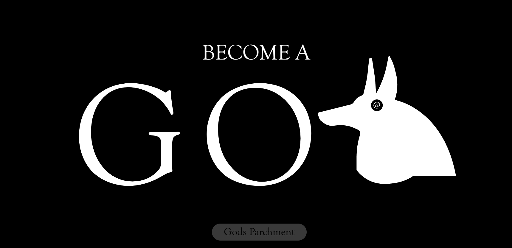
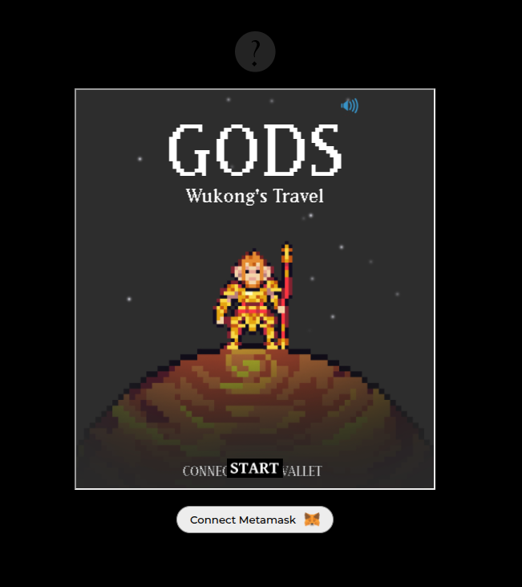
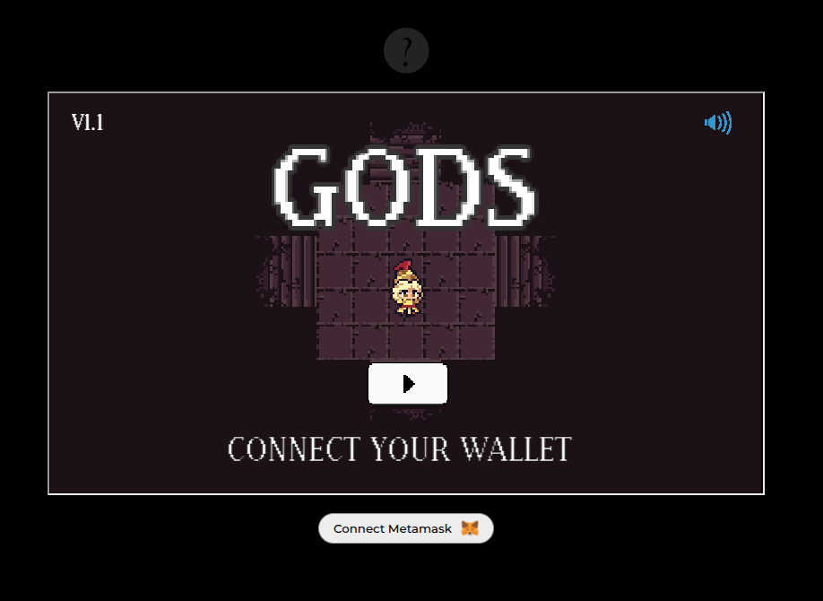
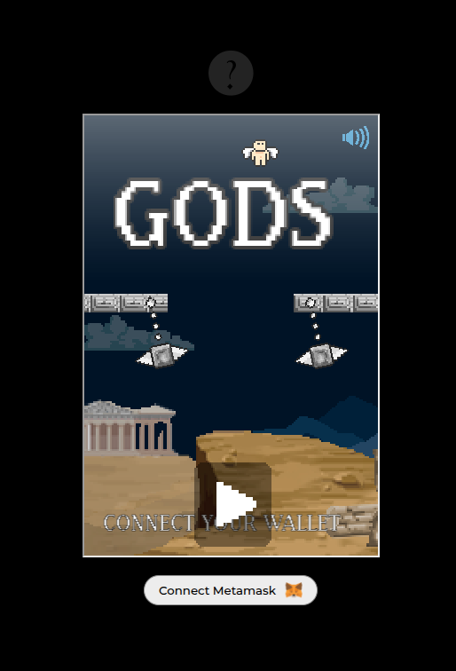

# Godz / Web3 Project - Launching Site

## About

Godz was a blockchain-based gaming platform launched in 2023. This is the launching website, that features monthly game releases where players can compete for prizes. The platform integrates with Web3 technology through MetaMask wallet connection and rewards top performers.

## Live Demo

Visit the live application at [https://godz-two.vercel.app/](https://godz-two.vercel.app/)

## Features

- Web3 integration with MetaMask wallet
- Monthly game releases
- Leaderboard system with rewards
- User authentication and registration
- Hidden mini-games for players to discover

## Hidden Games
The game where hidden in the pages sites.
Here is the links if you don't want to search.
The metamask login is not needed anymore.

### 1. Wukong's Travel
  

Access at: https://godz-two.vercel.app/r3h5yc9tf7t9pv2

### 2. Athena's Dungeon
  

Access at: https://godz-two.vercel.app/camacogame

### 3. Godz Wings
  

Access at: https://godz-two.vercel.app/85648646384

## Technology Stack

- Next.js
- Web3.js
- MetaMask Integration
- FaunaDB
- SCSS Modules
- Vercel Deployment

